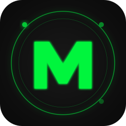

# MILO - Mission Intelligence Life Operator

<p align="center">
  
</p>

**A Signal-to-Noise Life Planner** that cuts through daily noise and helps you focus on goal-aligned actions. MILO combines AI-powered planning with activity monitoring to keep you on track.

## Quick Install (macOS)

1. **Download** the latest `MILO-x.x.x.dmg` from [Releases](../../releases)
2. **Open** the DMG and drag MILO to Applications
3. **First launch**: Right-click the app → "Open" (required for unsigned apps)
4. **Setup**: Enter your [Claude API key](https://console.anthropic.com/) in Settings

> **Note**: MILO is currently unsigned. macOS will warn about an "unidentified developer" on first launch. Right-click → Open bypasses this safely.

---

## What MILO Does

MILO is your personal life operating system with a retro Pip-Boy aesthetic:

### Core Features
- **Goal Hierarchy**: Beacon → Milestone → Objective → Task (dream big, execute small)
- **Morning Briefing**: AI-powered daily planning dialogue
- **Activity Monitoring**: Tracks your focus state (GREEN/AMBER/RED)
- **Drift Detection**: Gentle nudges when you veer off course
- **Evening Review**: Reflect on your day, adjust tomorrow's plan
- **S/N Scoring**: Gamified signal-to-noise ratio (0-100)

### The Signal Queue
Your top priorities, always visible. MILO surfaces what matters *right now* instead of burying you in endless lists.

### AI-Powered Planning
- Natural language task capture
- Automatic priority assignment
- Context-aware suggestions
- MCP integration for Claude Code

### Claude Code Integration (MCP)

MILO includes a Model Context Protocol server that lets Claude Code manage your tasks directly:

```
"Create a task called 'Build login form' with priority 1"
"Show me my signal queue"
"Mark task [id] as complete"
"Create a category called 'Sprint 5'"
```

**17 tools available:**
- 11 task tools (CRUD, lifecycle, signal queue, work tracking)
- 6 category tools (projects, organization, reordering)
- 4 read-only resources (signal queue, backlog, categories, today)

See [MCP Server README](./packages/mcp-server/README.md) for setup instructions.

## Architecture

```
┌─────────────────────────────────────────────────────────────────┐
│  MILO Electron App                                              │
│  ├── React + TypeScript frontend                                │
│  ├── SQLite database (better-sqlite3)                           │
│  └── AI integration (Claude API)                                │
└─────────────────────────────────────────────────────────────────┘
                              │
                              │ Shared SQLite Database
                              │
┌─────────────────────────────────────────────────────────────────┐
│  MCP Server (packages/mcp-server)                               │
│  ├── stdio transport for Claude Code                            │
│  ├── Task & Category tools                                      │
│  └── Real-time sync with Electron app                           │
└─────────────────────────────────────────────────────────────────┘
```

## Tech Stack

- **Frontend**: React 18, TypeScript, TailwindCSS
- **Desktop**: Electron with electron-vite
- **Database**: SQLite via better-sqlite3
- **AI**: Anthropic Claude API
- **MCP**: @modelcontextprotocol/sdk
- **Validation**: Zod
- **Testing**: Vitest, Playwright

## Development

### Prerequisites
- Node.js 18+
- npm or pnpm

### Setup

```bash
# Clone the repository
git clone https://github.com/eddiebe147/milo.git
cd milo

# Install dependencies
npm install

# Start development server
npm run dev
```

### Scripts

```bash
npm run dev          # Start Electron in dev mode
npm run build        # Build for production
npm run build:mac    # Build macOS app
npm run test         # Run unit tests
npm run test:e2e     # Run Playwright E2E tests
npm run mcp          # Start MCP server for Claude Code
npm run typecheck    # TypeScript type checking
npm run lint         # ESLint
```

### MCP Server Development

```bash
cd packages/mcp-server
npm install
npm run build
npm run dev    # Watch mode
```

## Project Structure

```
milo/
├── electron/              # Electron main process
│   ├── ai/               # AI integration (Claude API)
│   ├── services/         # Database, IPC handlers
│   └── main.ts           # Entry point
├── src/                   # React renderer
│   ├── components/       # UI components
│   ├── hooks/            # React hooks
│   └── stores/           # Zustand state
├── packages/
│   └── mcp-server/       # MCP server for Claude Code
└── tests/                 # E2E tests
```

## Database Schema

```sql
-- Tasks table
CREATE TABLE tasks (
  id TEXT PRIMARY KEY,
  title TEXT NOT NULL,
  description TEXT,
  status TEXT CHECK(status IN ('pending', 'in_progress', 'completed', 'deferred')),
  priority INTEGER CHECK(priority BETWEEN 1 AND 5),
  category_id TEXT REFERENCES categories(id),
  scheduled_date TEXT,
  start_date TEXT,
  end_date TEXT,
  estimated_days INTEGER DEFAULT 1,
  days_worked INTEGER DEFAULT 0,
  last_worked_date TEXT,
  created_at TEXT,
  updated_at TEXT
);

-- Categories table
CREATE TABLE categories (
  id TEXT PRIMARY KEY,
  name TEXT NOT NULL,
  color TEXT,
  sort_order INTEGER,
  created_at TEXT,
  updated_at TEXT
);
```

## Requirements

- **macOS** 10.15+ (Catalina or later)
- **Claude API key** from [Anthropic Console](https://console.anthropic.com/)
- ~200MB disk space

## Roadmap

### V1.1 (Planned)
- [ ] Notion integration (MCP)
- [ ] Apple Calendar sync (MCP)
- [ ] Apple Notes integration (MCP)

### Future
- [ ] Time blocking
- [ ] Mobile companion app
- [ ] Team collaboration

## Troubleshooting

**"MILO can't be opened because it is from an unidentified developer"**
→ Right-click the app → Open → Click "Open" in the dialog

**Activity monitoring not working**
→ Grant accessibility permissions: System Preferences → Security & Privacy → Privacy → Accessibility → Add MILO

**Claude API errors**
→ Verify your API key in Settings → Check your Anthropic account has credits

## License

MIT

## Author

Built by [ID8Labs](https://id8labs.com) - Eddie Belaval

---

*"The goal is not to do more. It's to do what matters."*
